# V0.9-S1 Phenology State Machine

**Contract:** `PHENOLOGY_STATE_MACHINE_VERSION=V0_9_S1_R1`  
**Evidence authority:** V0.9-S0 claim register and its pinned source matrix only.  
**Status:** guarded qualitative transitions; no calendar-only or numerical transition rule.

## 1. State semantics

The machine describes a scoped plant/cultivar production system through the annual cycle. `phenology_stage` is a biological state; observation dates and accumulated environment are inputs/evidence, not states by equivalence. State assignment must carry `OBSERVED`, `DERIVED`, `MODEL_INFERRED`, `LATENT`, or `UNBOUND` provenance and may remain unknown.

The deciduous path is the explicit chill/forcing route. The evergreen path is independently legal and may bypass a complete dormancy/chill-satisfied sequence. Evergreen is never represented as `DECIDUOUS` with a zero chill requirement. Shared bloom, fruit-set, fruit-stage, color-break, and ripe states are available only when supported by that system's observed or authorized state path.

## 2. Deciduous state path

The labels BLOOM_10/50/90 denote observed or method-derived proportions under a declared sampling protocol. They do not encode a fixed number of days between observations. STAGE_I/II/III are permitted internal theoretical states; S0 does not establish universal field-observation thresholds for their transitions.

## 3. Evergreen pathway

```mermaid
stateDiagram-v2
    direction LR
    [*] --> postharvest
    postharvest: POSTHARVEST
    vegetative: VEGETATIVE_REGROWTH
    budFormation: FLOWER_BUD_FORMATION
    evergreenContinuation: EVERGREEN_CONTINUATION
    budSwell: BUD_SWELL
    budBreak: BUD_BREAK
    bloom10: BLOOM_10
    bloom50: BLOOM_50
    bloom90: BLOOM_90
    fruitSet: FRUIT_SET
    greenFruit: GREEN_FRUIT
    stageOne: STAGE_I
    stageTwo: STAGE_II
    stageThree: STAGE_III
    colorBreak: COLOR_BREAK
    ripeState: RIPE
    postharvest --> vegetative: observed continued activity
    vegetative --> budFormation: bud formation evidence
    budFormation --> evergreenContinuation: system-specific active pathway
    evergreenContinuation --> budSwell: active bud development evidence
    budSwell --> budBreak: budbreak evidence
    budBreak --> bloom10: bloom observation
    bloom10 --> bloom50: bloom observation
    bloom50 --> bloom90: bloom observation
    bloom90 --> fruitSet: set evidence
    fruitSet --> greenFruit: fruit cohort evidence
    greenFruit --> stageOne: development evidence
    stageOne --> stageTwo: development evidence
    stageTwo --> stageThree: development evidence
    stageThree --> colorBreak: color transition evidence
    colorBreak --> ripeState: ripeness evidence
    ripeState --> [*]
```

This path expresses an allowed alternative, not a universal evergreen calendar. Dormancy or chill observations may still be recorded if relevant, but no absent measurement becomes zero and no dormancy state is inferred from the `EVERGREEN` label alone.

## 4. Transition contract

Every transition has the fields `from_state`, `to_state`, `required_condition`, `supporting_claim_ids`, `environment_drivers`, `management_drivers`, `cultivar_dependency`, `production_system_dependency`, and `confidence_class`. The complete transition register in `biological-state-registry-r1.json` also carries `transition_id`, `edge_ids`, and admission status. Confidence is evidence-bounded, not a probability.

| Transition | Required condition (qualitative) | Claim IDs | Environment / management drivers | Dependency / confidence boundary |
|---|---|---|---|---|
| POSTHARVEST → VEGETATIVE_REGROWTH | Postharvest scope and observed/authorized new vegetative activity | C001 | Temperature and plant state only when measured; postharvest pruning is a separate event | Cultivar/system dependent; supported context-dependent |
| VEGETATIVE_REGROWTH → FLOWER_BUD_FORMATION | Bud initiation/differentiation evidence or explicitly represented latent transition | C001, C003 | Photoperiod, temperature, light, canopy and management records when available | Strong cultivar and climate dependence; no universal induction date |
| FLOWER_BUD_FORMATION → ACCLIMATION | Seasonal transition is observed or represented as a bounded abstraction | C028 | Environment observations; canopy/management context | Integrated-cycle abstraction; not a fitted rule |
| ACCLIMATION → DORMANT | Deciduous system and dormancy evidence; calendar alone is insufficient | C010, C028 | Temperature exposure is recorded separately | Deciduous only; state may remain latent |
| DORMANT → CHILL_ACCUMULATING | Applicable deciduous chilling window with valid temperature observations | C010 | Sensor/weather input under source-priority and QC rules | Exposure may be derived; it does not prove release |
| CHILL_ACCUMULATING → CHILL_SATISFIED | Cultivar-bound chilling assessment or direct dormancy-release evidence; status may be `POSSIBLY_SATISFIED` | C012, C013 | Chilling model type/parameters must be bound and versioned before inference | No model selected; no global threshold |
| CHILL_SATISFIED → FORCING | Release evidence plus forcing environment/event; preserve separate chill and forcing records | C013 | Temperature, heating, closure/opening, treatment as distinct events | Deciduous forcing path; treatment is not chill accumulation |
| FORCING → BUD_SWELL | Bud development observation or authorized inferred state | C013, C022 | Air/root-zone temperature and forcing events if observed | Cultivar/system dependent; no GDD-to-date rule |
| BUD_SWELL → BUD_BREAK | Budbreak evidence under declared observation method | C022 | Microclimate and management context | Context-dependent; no calendar-only transition |
| BUD_BREAK → BLOOM_10 | Bloom observation reaches declared sampling threshold | C017, C028 | Temperature and pollination conditions recorded, not assumed | Observation state; threshold protocol is explicit |
| BLOOM_10 → BLOOM_50 | Bloom progress observation reaches the next declared threshold | C028 | Environment and management observations | Not a fixed day interval; staging threshold not universal |
| BLOOM_50 → BLOOM_90 | Bloom progress observation reaches the next declared threshold | C028 | Environment and management observations | Not a fixed day interval; staging threshold not universal |
| BLOOM_90 → FRUIT_SET | Fruit-set observation or authorized cohort-level estimate | C017 | Pollination, fertilization, temperature and events are separate inputs | Cultivar/pollination dependent |
| FRUIT_SET → GREEN_FRUIT | Fruit cohort exists with traceable bloom origin | C019, C021 | Temperature and source-sink context may be recorded | Cohort relation supported; quantity may be proxy/latent |
| GREEN_FRUIT → STAGE_I | Stage evidence or internal theoretical state progression | C021 | Temperature, cultivar and source-sink context | Stage labels permitted; threshold unbound |
| STAGE_I → STAGE_II | Stage evidence or internal theoretical progression | C021 | Environment and cohort thermal age if authorized | No universal stage threshold |
| STAGE_II → STAGE_III | Stage evidence or internal theoretical progression | C021 | Environment and cohort thermal age if authorized | No universal stage threshold |
| STAGE_III → COLOR_BREAK | Color-transition evidence | C020, C021 | Temperature/light and source-sink state as available | Cultivar dependent; no fixed date offset |
| COLOR_BREAK → RIPE | Declared ripeness observation/criterion | C020 | Environment and cohort history | Criterion and thermal kernel remain unbound |
| EVERGREEN_CONTINUATION → BUD_SWELL | System-specific active bud development evidence | C015 | Leaf retention, microclimate, management observations | Evergreen path; dormancy/chill not set to zero |

## 5. Dormancy and chilling are separate contracts

`DormancyState` permits `NOT_APPLICABLE`, `ENDO_DORMANT`, `CHILL_ACCUMULATING`, `CHILL_REQUIREMENT_POSSIBLY_SATISFIED`, and `RELEASED`. `CHILL_REQUIREMENT_POSSIBLY_SATISFIED` is not equivalent to observed physiological release. Every inferred state carries model version, cultivar binding, temperature source lineage, parameter authority, and `MODEL_INFERRED` status.

`ChillAccumulation` is a model-typed exposure measure. The contract permits `CHILL_HOURS`, `UTAH_CHILL_UNITS`, and `DYNAMIC_CHILL_PORTIONS`; S1 selects none (`PRODUCTION_DEFAULT_CHILL_MODEL=UNBOUND`). A value from one formulation cannot be compared with another as if the units were identical.

## 6. Forcing

`ForcingState` records accumulation and a model type; base temperature and upper temperature are nullable/unbound unless an authorized calibration or business authority supplies them. Forcing starts only as a distinct state/event after the applicable dormancy pathway is represented. Heating or closure does not assert chilling satisfaction or guarantee budbreak.

## 7. Invalid transitions and guards

The following are invalid in every production system: a transition inferred solely from a date difference; `chill_accumulation > 0` implying `RELEASED`; `EVERGREEN` implying zero chill; forcing implying dormancy release; bloom implying fruit set; ripe quantity implying harvested quantity; or any biological state writing factory arrival/harvest capacity. Deciduous chill states are not mandatory for the evergreen path. Direct `BLOOM → RIPE` and direct management-event → harvest-date transitions are prohibited.

## 8. Versioning

`PHENOLOGY_STATE_MACHINE_VERSION=V0_9_S1_R1`. State IDs are stable and unique. New states, transition guards, threshold definitions, or a change in production-system path require a contract revision and evidence update. S1 freezes the causal/state skeleton only; no model parameters or prediction algorithm are introduced.
