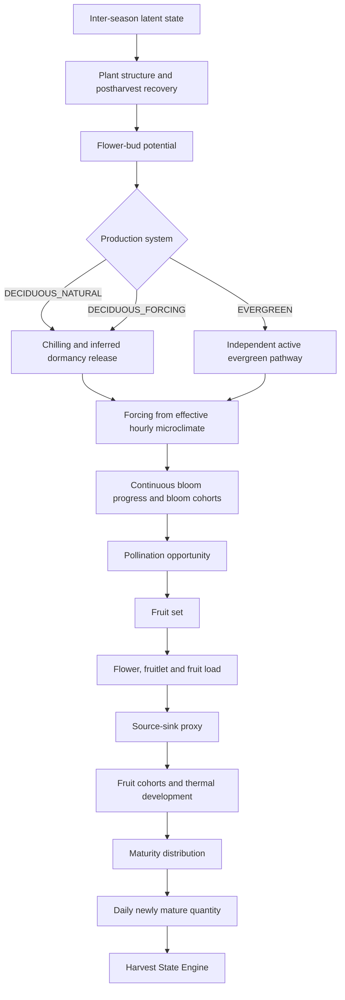

# V0.9-S3 — Theoretical Blueberry Growth Model R1

## Purpose and boundary

This deliverable is a deterministic, theory-first research simulator. Its causal
structure is informed by the pinned S0/S1 scientific authority and the additional
S3 source register. Numeric values in the reference parameter set exist only to
make synthetic scenarios executable. They are not company observations, fitted
values, Yunnan defaults, or production parameters.

The model does not consume or fit business data. It does not read, score, select,
or tune against the 2025–2026 benchmark. S2 data observability is retained for
future calibration planning and is not a gate on the theoretical mechanisms in
this simulator. S4 is not started.

V0.8's pooled-yield policy remains an empirical reference model. S3 does not
compare predictive accuracy against it.

## Pinned scientific inputs

S0 report SHA-256:
`827725a44094e5e15643186fe8f82095adbff0bfc2b2ac549aca6600d06a4c13`

S0 evidence SHA-256:
`530106f7291ab3d92fe4b0a0d682efc0fc154149218acda71369f76e785449cf`

S0 causal claims SHA-256:
`0ee8959db03f1ac28b226df06c00bf08c2427949b2f1e9de69a772bbd805d55a`

S1 evidence SHA-256:
`6b15a765e0d64643ebd657dc4bc6b254e416389e223a8b5ac8459275ed7f60b6`

S1 artifact manifest SHA-256:
`8ea4d508010e55c4996142ec96c389a91a356f78966e8f5d4fb4e449ef611381`

The full hashes for all pinned S0/S1 artifacts are in the machine evidence.
Equation entries bind each implemented relationship to S0 claim IDs and source
IDs. A source reference supports a mechanism or equation family only within its
reported cultivar, type, climate, and production-system scope.

## Model boundary and time scales

The simulator implements one-hour environmental inputs, hourly chill/forcing and
fruit thermal-age increments, daily state snapshots and maturity output, plus an
inter-season latent carryover result. Calendar dates identify observations and
management events; they are not used as fixed bloom-to-ripe offsets.

The top-level transition is `PlantState[t+1] = F(PlantState[t],
Environment[t], Management[t], CultivarParameters, ProductionSystemParameters)`.
The biological mass output is `DailyNewlyMature[t] = G(FruitCohorts[t],
DevelopmentState[t], SourceSinkState[t])`. These are explicit modular model
abstractions, not literature-validated universal equations.

The simulator emits three linked, distinct ledgers: `BloomCohortOutput`,
`FruitSetCohortOutput`, and `FruitDevelopmentCohortOutput`. The fruit-set record
references its bloom cohort; the development record references both its bloom
and fruit-set cohort. This preserves reproductive lineage instead of treating
flower number, set fruit, and ripening fruit as one interchangeable quantity.

The interface ends at `daily_newly_mature_quantity`. It does not calculate
harvest capacity, picking schedule, factory arrival, or routing. The downstream
Harvest State Engine remains responsible for mature inventory, loss, effective
capacity, harvested quantity, and closing inventory.

## State and unit conventions

* Per-plant reproductive and structural counts are nonnegative normalized
  proxies unless explicitly stated otherwise.
* `reserve_index`, vigor, canopy health, bloom progress, source-sink sufficiency,
  and ripe fractions are bounded indices in `[0, 1]`; reserve is a theoretical
  latent state, not carbohydrate concentration or a carbon mass balance.
* Environmental temperature is in °C; environment observations are hourly and
  strictly ordered. Radiation/light and canopy/source variables are normalized
  indices in the reference simulator.
* Thermal age and forcing are degree-days. Hourly contributions are divided by
  24 to express daily-equivalent thermal units.
* Fruit weight is g/berry, area is mu, plant density is plants/mu. The simulator
  returns both kg/plant/day and area-scaled kg/day; area and density scale the
  population output without changing per-plant biological states.
* Production-system and cultivar parameters remain scoped inputs. There is no
  global blueberry parameter set.

## Implemented equation set

The 30-row machine-readable equation register is authoritative for equation
classification and implementation references. The implemented forms below are
theoretical abstractions unless explicitly identified as literature equations.

### Structural engine and pruning

Productive canes are aggregated by age cohort:

`productive_canes = Σ(cane_count[a] × productive_fraction[a])`

`age_weighted_productivity = Σ(cane_count[a] × productive_fraction[a] × age_weight[a]) / productive_canes`

Age weights, maturity-age boundaries, shoot loss, wood loss, leaf loss, and
regrowth response are explicit scenario parameters. They do not encode a
universally optimal cane age. A pruning event changes fruiting wood, productive
cane/shoot indices, leaf-area potential, flower-bud retention and future shoot
potential through separate terms. This is not a direct yield multiplier.

Cane-age and pruning relationships use the scope-limited structural evidence in
M008/M009 and S0 claims, while numeric response strengths remain scenario-only.
Daily `PlantStatePoint` outputs expose productive canes, productive shoots per
plant, fruiting-wood index, vegetative-shoot potential, and leaf-area index so
structural interventions remain inspectable over the simulation timeline.

### Postharvest recovery and flower-bud potential

The reserve proxy changes by a bounded bookkeeping equation:

`R[t+1] = clamp(R[t] + gain × source − maintenance − fruit_cost × fruit_demand − other_cost × (growth_demand + storage_demand), 0, 1)`

The induction signal is a genotype-scoped weighted response abstraction over
photoperiod, temperature, vigor, reserve and prior crop load. Bud potential
increases only after its declared scenario signal threshold. A day-neutral or
everbearing pathway is explicit genotype input; this is not a universal
short-day threshold. The literature supports context-dependent environmental
and genotype effects, not this exact weighted equation.

### Dormancy, chilling and forcing

Three selectable exposure calculators are implemented. The simulator requires
the caller to pass a chill-model choice; no global/default production model is
selected. Golden fixtures explicitly exercise the Chill Hours candidate only as
their test configuration:

1. **Chill hours:** one unit for each hourly temperature in the declared
   `[0, 7.2] °C` interval.
2. **Utah chill units:** classic piecewise hourly weights. Its original model
   lineage is peach (M002); it is retained as a candidate method, not a
   blueberry-validated threshold.
3. **Dynamic chill portions:** stateful two-step precursor/product algorithm
   with the Fishman–Erez–Couvillon parameterization (M003/M004). Those constants
   are literature priors from a generic fruit-tree model, not blueberry
   production parameters.

Blueberry-specific evidence (M001) shows why these exposure models must not be
treated as interchangeable or universally accurate: chill effectiveness in
the tested highbush material was not captured fully by a simple below-7.2 °C
count or unmodified Utah weights. Exposure accumulation and inferred dormancy
release are separate state variables. The reference simulator enters an
inferred release state only when an explicitly supplied scenario threshold is
reached; this is not a direct physiological observation.

A declared dormancy-break treatment can modify that gate only when a scenario
explicitly supplies event intensity and a treatment-reduction parameter. This is
an `EXPLICIT_MODEL_ABSTRACTION` motivated by C014; S0 supports event semantics,
not product-specific dose or efficacy. The reference value is synthetic,
uncalibrated, and never a production recommendation. Without the event, the
ordinary chill threshold remains in force.

Forcing is accumulated after inferred release:

`forcing_increment_hour = max(0, min(T, T_upper) − T_base) / 24`

Bud-swell, bud-break and bloom thresholds are scenario parameters. A heat or
greenhouse event changes the effective environment in theoretical-scenario
mode; it never shifts a harvest date directly. Supplied/observed microclimate
passes through without a synthetic temperature offset.

### Evergreen pathway

Evergreen is an independent branch: leaves may be retained, reserve/source
activity can continue, bud potential may accumulate, and a supported genotype
may progress without the deciduous chill-release sequence. The simulator
requires an explicit cultivar-scoped `evergreen_dormancy_bypass` binding for
this route; an evergreen system label alone is rejected. It is not implemented
as `DECIDUOUS + chill_requirement = 0`. M005 is direct evidence for contrasting
spring-bearing and everbearing behavior in the tested SHB genotypes; it does
not establish that all evergreen systems behave alike.

### Bloom, pollination, fruit set and load

Bloom progression is represented continuously:

`bloom_progress = clamp((forcing − bloom_start) / bloom_duration, 0, 1)`

Each positive daily increment forms a bloom cohort. The 10/50/90% labels are
derived summaries, not calendar rules. A pollination window can gate the
scenario opportunity index; pollinator introduction changes that index only
within the declared synthetic abstraction. Pollinator presence is not
fertilization.

`fruit_set_count = min(effective_pollinated_flowers × fruit_set_probability, effective_pollinated_flowers)`

The probability is a bounded, parameterized function of pollination opportunity,
source-sink sufficiency, and temperature suitability. Flower and fruit counts
are conserved: pollinated flowers cannot exceed flowers, and set fruit cannot
exceed effective pollinated flowers. Flower thinning removes reproductive load
while preserving leaf-source state; pruning changes both structure/source and
reproductive potential. Fruitlet/fruit thinning removes existing fruit only.

### Source–sink proxy

The implemented dimensionless proxy is:

`light_response = max(light, 0) / (max(light, 0) + light_half_saturation)`

`source = max(leaf_area, 0) × max(canopy_health, 0) × light_response × temperature_suitability + reserve × reserve_mobilization`

`sink = stage_weighted_fruit_demand + vegetative_demand + root_demand + storage_demand`

`sufficiency = clamp(source / max(sink, ε), floor, ceiling)`

This is an `EXPLICIT_MODEL_ABSTRACTION`: an index, not a photosynthesis rate,
carbon pool, or universal leaf-area-to-fruit equation. Source and sink are
composite states; neither is reduced to leaf area or fruit number alone. Stage
weights and all response coefficients are scenario assumptions. S0/S3 evidence
supports source-sink effects on fruit traits, but not this exact whole-plant
formula.

### Fruit development and maturity distribution

Fruit cohort physiological age accumulates hourly thermal development:

`thermal_age[t+1] = thermal_age[t] + max(T − T_base, 0) / 24`

Stage I/II/III and color-break labels are internal theoretical stages based on
scenario thresholds; they are not asserted to be directly observable in the
current enterprise data.

Fruit size potential has three selectable, bounded theoretical references:

* `DOUBLE_LOGISTIC`: normalized sum of two logistic increments;
* `DOUBLE_GOMPERTZ`: normalized sum of two Gompertz increments;
* `STAGEWISE_THERMAL`: continuous piecewise thermal-age trajectory with two
  declared stage boundaries and a final-age bound.

`DOUBLE_LOGISTIC` is the deterministic simulator default, not a literature-
selected universal curve. M011 reported a Gompertz-II fit as best among tested
forms for its scoped cultivars and study conditions; that result motivates
keeping the alternative available, not adopting it globally. Curve parameters
are synthetic scenario assumptions. A logistic cumulative distribution
separately spreads cohort maturity over thermal age:

`F_ripe[i,t] = logistic(thermal_age[i,t], median_i, width_i)`

`newly_mature_kg_per_plant[t] = Σ fruit_count[i] × berry_weight[i,t] / 1000 × max(ΔF_ripe[i,t], 0) × marketable_fraction[i]`

`newly_mature_kg_area[t] = newly_mature_kg_per_plant[t] × productive_area_mu × plant_density_per_mu`

Berry-weight and ripe-median modifiers accept separate source and latent
pollination/seed-effect indices. These indices are not seed counts; the response
coefficients are explicit synthetic assumptions. The pathway remains inspectable
without fabricating observations.

Seed effects are represented only by a latent scenario index derived from
pollination opportunity; actual seed counts are not fabricated. The daily
quantity is newly biologically mature mass, not harvested quantity or arrival.
Both per-plant and area-scaled mass are emitted, preserving the population-scaling
boundary explicitly.
Each simulation output records its input SHA-256, model version, cultivar,
production system, area and density, selected chill algorithm, fruit-growth
curve, parameter-set identifier, and canonical parameter-set SHA-256. Daily
aggregation requires 24 complete hourly environment records per calendar day;
partial-day input fails closed rather than silently understating thermal sums.

### Inter-season carryover

The model exports normalized latent carryover terms for reserve, vigor, and
next-season flower-bud potential. Previous crop load can reduce these outputs
through explicit scenario coefficients. This closes a causal path from current
crop load to next-season potential, but it is not a calibrated carryover law.

## Management event semantics

The simulator applies the following intervention families: pruning/cane renewal,
flower-bud/flower thinning, fruitlet/fruit thinning, greenhouse close/open,
heating start/stop, scenario shade, leaf retention/defoliation, dormancy-break
treatment trace, pollination windows, and pollinator introduction. Every event
is sorted deterministically by datetime and event ID. Effects are written to
`simulation_trace`.

Some S1 event types, such as irrigation stress and nutrition intervention,
remain explicitly unbound in S3. They are not silently assigned a physiological
coefficient: their trace says `NO_PHYSIOLOGICAL_EFFECT_BOUND_IN_S3`. A
dormancy-break treatment modifies only the inferred release gate through an
explicit, synthetic, uncalibrated scenario parameter; it is not a treatment
recommendation or production efficacy claim. Shade affects supplied scenario
radiation only; supplied observed microclimate is not adjusted again.

## Parameters and lifecycle

`reference_parameter_set()` supplies a named, unit-bearing set for synthetic
replay. All non-Dynamic-Model values are tagged `MODEL_ASSUMPTION`, scoped to a
reference scenario and marked `production_eligible=false`. The six Dynamic
Model constants are tagged `LITERATURE_PRIOR`, cite M003/M004, and remain
`production_eligible=false`. A parameter-set validator fails if the set is not
explicitly scenario-only or if any parameter is production eligible.

`PRODUCTION_DEFAULT_CHILL_MODEL=UNBOUND`.
All cultivar/system response values remain scenario scoped. No production
parameter is created, no business data is fitted, and no S2 observability
status promotes a theory mechanism or its parameters.

### S0 not-ready mechanism quarantine

The six S0 not-ready claims remain quarantined from production parameterization
and validated biological-fact status: C005 (pruning-window effect ordering),
C009 (an exact whole-plant source-sink law), C011 (production chill-model
selection), C016 (a universal evergreen/zero-chill rule), C024 (a quantitative
light/CO2-to-season-yield law), and C027 (portable stage labels/thresholds).
Where S3 needs a runnable theoretical structure, it uses only explicit,
synthetic assumptions: pruning event types receive scenario magnitudes; the
source-sink engine emits an index; chill algorithms remain caller-selected;
evergreen bypass requires cultivar-scoped binding; light response is a
scenario proxy; fruit stages use uncalibrated internal thermal boundaries.
None of those abstractions promotes a claim to a production default or
calibrated mechanism.

## Synthetic reference scenarios

Eleven deterministic golden scenarios cover deciduous-natural, deciduous
forcing, evergreen, light/heavy pruning, no/moderate flower thinning, low/high
crop load and low/high pollination opportunity. Temperature, radiation,
photoperiod, dates, and event schedules are generated synthetically in test
fixtures. Scenario names and the parameter-source/lifecycle boundary are in
`reference-scenario-manifest-r1.json` and the test golden manifest.

They test qualitative response and invariants, not whether the simulated
kilograms resemble a farm. No WAPE, MAE, real-harvest comparison, or production
readiness conclusion is computed.

## Scientific evidence and scope

Examples of directly relevant, scope-limited sources include: highbush chilling
model evaluation (Norvell & Moore, 1982, M001); photoperiod/temperature effects
in ‘Misty’ SHB (Spann et al., 2004, M006); highbush pruning severity (Strik et
al., 2003, M008); cane-level source-sink field evidence (Jorquera-Fontena et
al., 2018, M010); cultivar-dependent highbush double-sigmoid fits (Godoy et
al., 2008, M011); high-tunnel SHB microclimate (Ogden & van Iersel, 2009,
M015); and the controlled SHB genotype contrast for everbearing behavior
(Benevenute et al., 2025, M005).

Direct publication records: [highbush chilling evaluation](https://doi.org/10.21273/JASHS.107.1.54),
[‘Misty’ photoperiod/temperature study](https://doi.org/10.21273/JASHS.129.3.294),
[highbush pruning trial](https://doi.org/10.21273/HORTSCI.38.2.196),
[SHB source-sink field study](https://doi.org/10.1016/j.scienta.2018.06.041),
[highbush fruit-growth curve study](https://doi.org/10.1016/j.scienta.2007.10.018),
[high-tunnel SHB microclimate study](https://doi.org/10.21273/HORTSCI.44.7.1850),
[everbearing SHB genotype contrast](https://doi.org/10.1016/j.scienta.2025.114463),
and [pollination/seed effects](https://doi.org/10.1016/j.scienta.2021.110313). These
sources support scoped mechanisms and candidate structures; their values are
not promoted to global production parameters.

These studies do not support universal numeric coefficients across highbush
types, cultivars, climates, or production systems. The S3 source register records
study context, effect direction, uncertainty, and non-generalization boundaries.

## Limitations and next boundary

This is a deterministic theoretical simulator, not a production crop model. It
uses normalized indices, compact response functions, coarse structural and
fruit-load proxies, and synthetic scenario parameter values. It does not
simulate a full carbon balance, root hydraulics, stochastic flower/fruit
variation, a calibrated chill requirement, or data-derived cultivar parameters.
It does not assume missing observations equal biological zero.

S3 acceptance is based on scientific structure, traceability, deterministic
replay, qualitative counterfactual behavior, and conservation invariants only.
Calibration and identifiability belong to a separately authorized S4 task.
